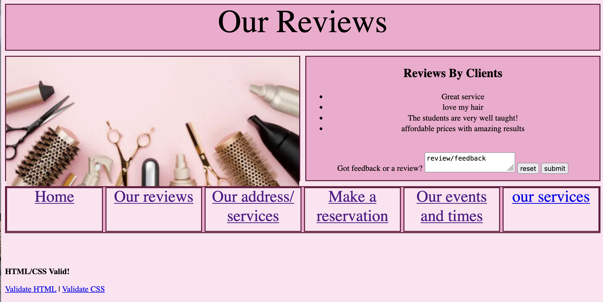
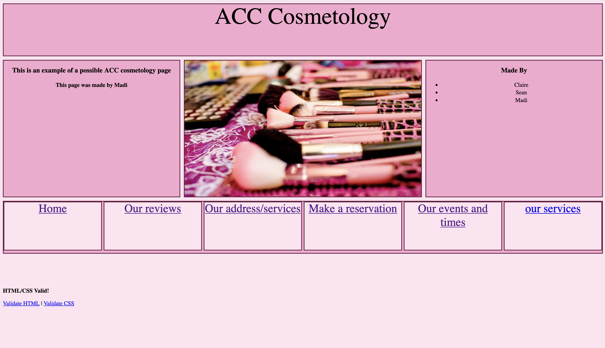

here is a link to the website
<a href="https://cworst.github.io/the-second-choices/">Me Sean and Claires project</a>

<a href="https://github.com/cworst/the-second-choices">our repo</a>

My form is a long text entry for in depth feedback. I chose a post request beacause I dont want it to be put in the url and I didnt want there to be a limit to the wordcount. Reviews should also be private so not having the text in the url would be more secure.
 
my pages

 
the development process
 
I think the development was really difficult. Sharing code was hard because people didnt use the same coding style I did or the same types of commands. There was a whole deal with the DS store that I hope I never have to relive again (I had a problem after school that I forced Ben to help me with). I had to be fully conscious of when I was about to commit (I yelled 'DONT PUSH IM PUSHING' several times). I did not like using the separate branches to commit because I would be asleep and someone would try and commit something but I would be able to until they told me to commit it in person. Overall, I do like the project and the way it helped us understand collaborating with others but this project was a STRUGGLE.  
